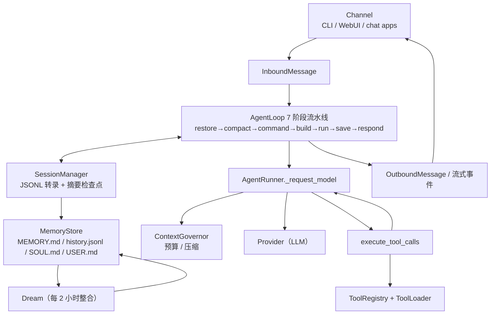

# 架构总览：nanobot 是怎样跑起来的

> 基线：nanobot v0.3.5 / commit `2fb165939`，本地只读参照在 `nanobot/`。
> **路径约定**：`agent/loop.py:196` 指上游包内的 `nanobot/nanobot/agent/loop.py` 第 196 行。
> 本文是 **Phase 0 + Phase 1 的验收材料**：先回答「怎么启动」「一条消息经过哪些模块」，
> 再给出模块地图与深入阅读索引。细节见 [`agent-loop.md`](./agent-loop.md)、
> [`context.md`](./context.md)、[`memory.md`](./memory.md)、[`tool-system.md`](./tool-system.md)。

## 0. 基线与环境

| 项 | 值 |
| --- | --- |
| 上游仓库 | `HKUDS/nanobot`，版本 v0.3.5，参照 commit `2fb165939` |
| 本地路径 | `nanobot/`（`.gitignore` 排除；不参与本项目构建） |
| 运行环境 | Python 3.12.5，虚拟环境 `nanobot/.venv` |
| 配置 | `~/.nanobot/config.json`（preset `deepseek-v4.1-flash`，`maxToolIterations = 200`） |
| 工作区 | `~/.nanobot/workspace/`（memory、skills、生成文件） |
| 会话存储 | `~/.nanobot/sessions/<workspace-id>/`（JSONL，**刻意放在 workspace 之外**） |

## 1. 一张图看懂



## 2. 验收问题一：nanobot 如何启动？

### 2.1 控制台入口

```toml
# nanobot/pyproject.toml
[project.scripts]
nanobot = "nanobot.cli.entry:main"
```

`cli/entry.py:71` 的 `main()` 是**轻量入口**：先判断参数形态，把 `nanobot`、
`nanobot agent`、`nanobot -m "..."` 都路由到 agent 路径；只有其它子命令才加载完整 typer 应用图。

### 2.2 `nanobot agent` 的装配顺序

| 步骤 | 动作 | 位置 |
| --- | --- | --- |
| 1 | 解析运行时配置（读 `~/.nanobot/config.json`，合并 CLI 覆盖） | `config/loader.py`、`cli/runtime_config.py` |
| 2 | 由 provider 注册表把「provider + model + preset」解析成 provider 实例 | `providers/factory.py`、`providers/registry.py:22` |
| 3 | 同步工作区模板（保证 `AGENTS.md` / `SOUL.md` / `USER.md` 存在） | `utils/` `sync_workspace_templates` |
| 4 | 创建消息总线 | `bus/queue.py:19` `MessageBus` |
| 5 | 创建工作区级 cron 服务 | `cron/service.py` |
| 6 | 创建工具注册表，并把 MCP 工具挂到同一张表上 | `agent/tools/registry.py:19`、`agent/tools/mcp.py` |
| 7 | 用以上依赖构造 Agent 核心 | `cli/agent.py:171` → `agent/loop.py:458` `AgentLoop.from_config` |
| 8 | 进入运行形态（见下） | `cli/agent.py:238`、`303` |

第 8 步的两种形态：

- **单条消息**：`AgentLoop.process_direct()`（`agent/loop.py:2318`），不走总线。
- **交互模式**：`asyncio.create_task(agent_loop.run())`（`cli/agent.py:303`）常驻消费总线，
  同时 CLI 侧协程消费 `bus.outbound`，用 `StreamRenderer`（`cli/stream.py:88`）渲染流式输出。

### 2.3 其它启动形态

- `nanobot gateway`：启用 chat channels / WebSocket channel / cron / 系统任务（含 Dream）；
  健康检查 `:18790/health`，WebUI/WebSocket 默认 `:8765`。
- SDK：`Nanobot.from_config()`（`nanobot.py:68`）→ `run()` / `run_streamed()`（`nanobot.py:144`），
  供进程内嵌使用；SDK 自己持有 `ToolRegistry` 与 `MCPProvider` 并负责释放。

### 2.4 一句话回答

> `nanobot` 命令由 `nanobot.cli.entry:main` 进入并路由到 agent 命令；`cli/agent.py` 依次装配
> config → provider → workspace 模板 → MessageBus → cron → ToolRegistry/MCP → `AgentLoop`，
> 然后要么 `process_direct()` 单次执行，要么 `agent_loop.run()` 常驻消费总线。

## 3. 验收问题二：一条消息进入系统后，经过哪些模块？

### 3.1 消息流（1.1 要求的那张图）

```text
User
 ↓  频道把输入归一化
InboundMessage{channel, sender_id, chat_id, content}      bus/events.py:25
 ↓  publish_inbound
MessageBus.inbound（asyncio.Queue）                        bus/queue.py:19
 ↓  AgentLoop.run() 取消息、按会话派发任务                  agent/loop.py:1261、1391
AgentLoop（7 阶段流水线）                                   agent/loop.py:1594
 ├─ restore  恢复未完成 turn 的 checkpoint                  agent/loop.py:1748
 ├─ compact  空闲压缩准备                                   agent/loop.py:1805
 ├─ command  斜杠命令直通（命中则本轮结束）                    agent/loop.py:1813
 ├─ build    取 session 历史 + 组 TranscriptInput            agent/loop.py:1865
 ├─ run      ↓
 │   AgentRunner._run_core（for iteration in max_iterations）agent/runner.py:386、435
 │    ├─ _request_model：ContextGovernor 拟合预算 → provider   agent/runner.py:865 / agent/context_governance.py:593
 │    ├─ 有 tool_calls？→ execute_tool_calls                  agent/tools/execution.py:56
 │    │     └─ ToolRegistry.prepare_call → Tool.execute        agent/tools/registry.py:110
 │    ├─ 把结果写成 role="tool" 消息，回到循环起点              agent/runner.py:533
 │    └─ 无 tool_calls → 生成最终回答 / 终止判定               agent/runner.py:756-791
 ├─ save     写回 session（含摘要检查点、usage、latency）        agent/loop.py:2014、2140
 └─ respond  组装 OutboundMessage                             agent/loop.py:2063、1716
 ↓  TurnDelivery 发送 / 流式收尾
MessageBus.outbound → 频道渲染                                bus/events.py:53、cli/stream.py:88
```

### 3.2 逐步说明

| # | 环节 | 说明 | 位置 |
| --- | --- | --- | --- |
| 1 | 归一化入站消息 | 与平台无关的 `InboundMessage` | `bus/events.py:25` |
| 2 | 入队 | 频道与 agent 核心解耦 | `bus/queue.py:19` |
| 3 | 取消息 + 派发 | 会话内串行、跨会话并发；同会话追加消息进 pending queue | `agent/loop.py:1261`、`1391`、`1361` |
| 4 | 会话解析 | key = `channel:chat_id`；LRU 缓存 + JSONL 持久化 | `agent/loop.py:901`、`session/manager.py:1644`、`548` |
| 5 | 上下文原料 | `TranscriptInput` = history + 本轮输入 + media + 会话摘要 | `agent/loop.py:1865`、`agent/context.py:73` |
| 6 | 模型-工具循环 | 每次请求前做预算拟合；工具结果回灌；直到最终回答或触发上限 | `agent/runner.py:386`、`865`、`533`、`790` |
| 7 | 工具执行 | 按并发安全性分批；失败转成可读提示 | `agent/tools/execution.py:56`、`292` |
| 8 | 记忆写回 | 转录落盘；超预算/空闲时归档为摘要检查点与日记 | `agent/loop.py:2014`、`agent/memory.py:996`、`session/manager.py:323` |
| 9 | 出站 | `OutboundMessage` / 流式事件（delta / end / response） | `bus/events.py:53`、`bus/outbound_events.py` |

### 3.3 一句话回答

> 用户输入被频道归一化成 `InboundMessage` 进入 `MessageBus`；`AgentLoop` 按会话取出后跑
> restore→compact→command→build→run→save→respond 七阶段，其中 `build` 用 `SessionManager` 的历史和
> `Memory` 组出 `TranscriptInput`；`AgentRunner` 在 `max_iterations` 内反复「请求模型 → 执行工具 →
> 回灌结果」，每次请求前由 `ContextGovernor` 按 token 预算拟合上下文，并可能触发摘要压缩；
> 最终回答与流式事件经 `bus.outbound` 回到频道渲染。

## 4. 四条必须记住的边界

| 边界 | 上游体现 | 为什么重要（对应我们后续的设计） |
| --- | --- | --- |
| **Loop / Runner 分离** | `agent/loop.py:196` ↔ `agent/runner.py:141`，单向依赖 | Phase 3 解耦 AgentLoop；Runner 可独立测试；Context 治理挂在 Runner 请求前 |
| **Bus 解耦频道与核心** | `bus/queue.py:19`，只认识 `InboundMessage`/`OutboundMessage` | 垂直 Agent 只需实现一个「频道」，不用改核心 |
| **Session / Memory 分离** | `session/manager.py:276` ↔ `agent/memory.py:58` | Phase 4 分层记忆的基础：Session 是过程，Memory 是结论 |
| **原始转录 ≠ 模型请求** | `Session.messages` ↔ `ContextGovernor` 拟合结果 | 没有这条区分，压缩 / RAG / 记忆注入都会变成不可解释的删改（见 `context.md`） |

## 5. 模块地图

| 模块 | 上游文件 | 职责 | 本项目计划 |
| --- | --- | --- | --- |
| Agent Loop | `agent/loop.py` | 面向频道的一轮 turn：会话、阶段流水线、落盘、出站 | Phase 2 迁移，Phase 3 拆出 `ContextManager` |
| Agent Runner | `agent/runner.py` | 面向模型的多轮工具循环、终止判定、注入、checkpoint | Phase 2 迁移为独立可测组件 |
| Context 组装 | `agent/context.py` | system prompt / bootstrap / transcript | Phase 6 改为「优先级 + 预算」流水线 |
| Context 治理 | `agent/context_governance.py` | 预算、结构修复、压缩触发 | Phase 6 重写（保留三级测量与四步拟合） |
| Memory | `agent/memory.py` | 记忆文件 I/O、归档、Dream 整合 | Phase 4 拆成 Working / Episodic / Semantic + Retriever |
| Session | `session/manager.py` | 会话身份、JSONL 存储、摘要检查点、恢复 | Phase 2 迁移（保留 JSONL + 隐藏边界思想） |
| Bus | `bus/` | 频道与核心解耦 | Phase 2 迁移（简化实现） |
| Tools | `agent/tools/` | 工具契约、注册表、发现、执行与护栏 | Phase 2 迁移 Registry，Phase 7 扩展领域工具 |
| Providers | `providers/` | 多 provider 适配与选择 | Phase 2 抽象 `BaseModel` + 最少 provider 实现 |
| Dream / cron / subagent / channels | `cron/`、`agent/subagent.py`、`channels/` | 定时任务、子 agent、多频道 | 不做（见 `PLAN.md` 2.2 节） |
| RAG | —— | 上游没有等价模块 | Phase 5 新增 |

## 6. 复现命令

```bash
cd nanobot
.venv/bin/nanobot --version          # 🐈 nanobot v0.3.5
.venv/bin/nanobot agent -m "hello"   # 单条消息
.venv/bin/nanobot agent              # 交互模式
```

读代码时建议按这条顺序定位：`cli/entry.py:71` → `cli/agent.py:171` → `agent/loop.py:1261` →
`agent/loop.py:1594` → `agent/loop.py:939` → `agent/runner.py:386` → `agent/tools/execution.py:56`。

## 7. 深入阅读

| 主题 | 文档 | 覆盖内容 |
| --- | --- | --- |
| Loop / Runner | [`agent-loop.md`](./agent-loop.md) | 装配、消息接收、并发模型、7 阶段、Runner 主循环、上限与终止、注入、checkpoint |
| Tool | [`tool-system.md`](./tool-system.md) | Tool 契约、Schema、Registry、发现、并发执行、错误语义、安全边界 |
| Context | [`context.md`](./context.md) | system prompt 分层、transcript 组装、预算与四步拟合、摘要压缩、空闲压缩 |
| Memory | [`memory.md`](./memory.md) | Session vs Memory、history.jsonl、归档与摘要检查点、Dream、记忆进入上下文的路径 |
