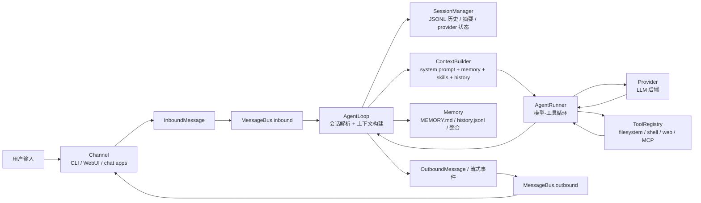

# nanobot Baseline 架构与消息流

本文件是 **Phase 0 的验收材料**，回答计划书里的两个问题：

1. nanobot 如何启动？
2. 一条用户消息进入系统后，经过哪些模块？

Phase 1 会在本文基础上继续深入到 Memory / Tool / Session 的实现细节（见文末「待深入确认」）。

## 0. 基线版本

| 项 | 值 |
| --- | --- |
| 上游仓库 | `HKUDS/nanobot` |
| 版本 / commit | v0.3.5 / `2fb165939` |
| 本地路径 | `nanobot/`（`.gitignore` 排除，只读参照，不参与本项目构建） |
| 运行环境 | Python 3.12.5，虚拟环境 `nanobot/.venv` |
| 配置 | `~/.nanobot/config.json`（模型 preset `deepseek-v4.1-flash`） |
| 工作区 | `~/.nanobot/workspace/`（memory、skills、生成文件） |
| 会话存储 | `~/.nanobot/sessions/<workspace-id>/`（JSONL，独立于 workspace） |

## 1. 验收问题一：nanobot 如何启动？

### 1.1 控制台入口

`pyproject.toml` 里声明了两个脚本：

```toml
[project.scripts]
nanobot = "nanobot.cli.entry:main"
nanobot-desktop-tui = "nanobot.cli.desktop_tui:main"
```

`nanobot/cli/entry.py:71` 的 `main()` 是一个**轻量入口**：它不导入整张 CLI 依赖图，而是
判断参数形态后把请求路由到 `agent` 命令（`nanobot`、`nanobot agent`、`nanobot -m "..."` 都进
agent 路径），只有其它子命令（`gateway`、`onboard`、`provider` 等）才加载完整 typer 应用。

### 1.2 `nanobot agent` 的装配顺序

装配代码在 `nanobot/cli/agent.py`（交互模式与单条消息模式共用同一套装配）：

| 步骤 | 动作 | 位置 |
| --- | --- | --- |
| 1 | 解析运行时配置：读 `~/.nanobot/config.json`，合并 CLI 覆盖项 | `config/loader.py`、`cli/runtime_config.py` |
| 2 | 依据 provider 注册表把 "provider + model + preset" 解析成具体 provider 实例 | `providers/factory.py`、`providers/registry.py:22` |
| 3 | 同步工作区模板，保证 `AGENTS.md` / `SOUL.md` / `USER.md` 等 bootstrap 文件存在 | `utils/`（`sync_workspace_templates`） |
| 4 | 创建消息总线 | `bus/queue.py:19` `MessageBus` |
| 5 | 创建工作区级定时任务服务（`workspace/cron/jobs.json`） | `cron/service.py` |
| 6 | 创建工具注册表，并把 MCP 工具挂到同一张注册表上 | `agent/tools/registry.py`、`agent/tools/mcp.py` |
| 7 | 用上面的依赖构造 Agent 核心 | `agent/loop.py:196` `AgentLoop.from_config(...)` |
| 8 | 进入运行模式（见下） | `cli/agent.py` |

第 8 步有两种形态：

- **单条消息模式**（`-m "..."`）：直接调用 `AgentLoop.process_direct()`（`agent/loop.py:2318`），不走总线。
- **交互模式**：`asyncio.create_task(agent_loop.run())`（`agent/loop.py:1261`）让 Agent 持续消费总线，
  同时 CLI 侧有一个协程消费 `bus.outbound` 并用 `StreamRenderer`（`cli/stream.py:88`）渲染流式输出。

### 1.3 其它启动形态

- `nanobot gateway`：启动已启用的 chat channels、WebSocket channel、工作区级 cron 与系统任务
  （Dream / heartbeat）；健康检查在 `:18790/health`，WebUI/WebSocket 默认在 `:8765`。
- SDK：`Nanobot.from_config()`（`nanobot.py:68`）→ `run()` / `run_streamed()` / `stream()`（`nanobot.py:144`），
  供进程内嵌使用；SDK 自己持有 `ToolRegistry` 与 `MCPProvider`，并在关闭时负责释放。

### 1.4 一句话回答

> `nanobot` 命令由 `nanobot.cli.entry:main` 进入并路由到 agent 命令，`cli/agent.py`
> 先解析配置、构造 provider / 总线 / cron / 工具注册表，再用这些依赖实例化 `AgentLoop`；
> 之后要么单次 `process_direct()`，要么 `agent_loop.run()` 常驻消费总线。

## 2. 验收问题二：一条用户消息进入系统后，经过哪些模块？



| # | 环节 | 说明 | 位置 |
| --- | --- | --- | --- |
| 1 | 归一化为 `InboundMessage` | 频道无关的入站消息：`channel` / `sender_id` / `chat_id` / `content` | `bus/events.py:25` |
| 2 | 入队 | 频道把消息推入 `MessageBus.inbound`，与 agent 核心解耦 | `bus/queue.py:19` |
| 3 | AgentLoop 取消息 | `AgentLoop.run()` 循环消费入站队列，决定本轮 turn 的种类与作用域 | `agent/loop.py:1261` |
| 4 | 会话解析与加载 | session key（`channel:chat_id`）→ `SessionManager` → JSONL 会话文件：历史、摘要检查点、provider 继续状态 | `session/manager.py:1644`、`:276`、`:548` |
| 5 | 上下文构建 | `ContextBuilder` 组装 system prompt、bootstrap 文件（`AGENTS.md`/`SOUL.md`/`USER.md`）、skills、工具定义、会话历史与 memory 片段，并按上下文窗口做裁剪/压缩 | `agent/context.py:89` |
| 6 | 模型-工具循环 | `AgentRunner.run(AgentRunSpec)` 调用 provider（支持流式 delta / reasoning 块），执行 tool calls，把 tool 结果回灌模型，直到产出最终回答或触发迭代/长度上限 | `agent/runner.py:141`、`:89`、`:308` |
| 7 | 工具执行 | tool 调用经 `ToolRegistry` 分发到具体工具（文件、shell、web、MCP、cron 等），单个结果有长度上限 | `agent/tools/registry.py`、`agent/tools/*` |
| 8 | 记忆写回 | 轮次结束后由 `MemoryArchiver` / `Consolidator` 把转录追加进 `history.jsonl`、更新 `MEMORY.md`；Dream 负责更慢的 SOUL/USER/MEMORY 整合 | `agent/memory.py:758`、`:1072`、`:58` |
| 9 | 出站与渲染 | `OutboundMessage` 与流式事件（delta / end / response）进入 `bus.outbound`，由频道侧渲染或发送 | `bus/events.py:53`、`bus/outbound_events.py`、`cli/stream.py:88` |

### 2.1 一句话回答

> 用户输入先被频道归一化成 `InboundMessage` 进入 `MessageBus`，`AgentLoop` 取出后解析会话、
> 由 `ContextBuilder` 组装上下文，交给 `AgentRunner` 跑「模型 ↔ 工具」循环，期间读写
> `SessionManager` 的 JSONL 历史与长期 Memory；最终回答连同流式事件经 `bus.outbound` 回到频道渲染。

## 3. 与本项目的关系

| 上游模块 | 上游文件 | 职责 | 本项目计划 |
| --- | --- | --- | --- |
| Agent Loop | `agent/loop.py` | 面向频道的一轮 turn：会话、上下文、hooks、出站 | Phase 2 迁移，Phase 3 拆成 `AgentLoop` + `ContextManager` |
| Agent Runner | `agent/runner.py` | 面向模型的多轮工具循环、迭代与长度限制 | Phase 2 迁移为独立可测组件 |
| Context | `agent/context.py` | system prompt / bootstrap / 历史 / memory 组装 | Phase 6 用优先级 + 预算模型重写 |
| Memory | `agent/memory.py` | 记忆文件 I/O、归档、整合（Dream） | Phase 4 拆成 Working / Episodic / Semantic + Retriever |
| Session | `session/manager.py` | 会话历史、摘要、provider 继续状态、JSONL 存储 | Phase 2 迁移，保留 JSONL 存储思想 |
| Bus | `bus/` | 频道与 agent 核心解耦 | Phase 2 迁移（保留抽象，简化实现） |
| Tools | `agent/tools/` | 工具 schema、注册表、执行与沙箱 | Phase 2 迁移 Registry，Phase 7 扩展领域工具 |
| Providers | `providers/` | 多 provider 适配与选择 | Phase 2 抽象 `BaseModel` + 最少 provider 实现 |
| 无 | 无 | 文档检索 / 向量检索 | Phase 5 新增 `rag/`（上游没有等价模块） |

### 3.1 迁移时要保留的三个设计判断

1. **Loop / Runner 分离**：频道语义（会话、工作区、出站）与模型语义（provider、tool 循环、迭代上限）
   是两件不同的事，分开后两者都能单独测试。
2. **Bus 解耦**：频道只认识 `InboundMessage` / `OutboundMessage`，agent 核心不感知具体平台。
3. **Session 与 Memory 分离**：session 是「这次对话的短期状态」，memory 是「跨 session 的长期沉淀」，
   二者生命周期和存储形态都不同。

## 4. 复现命令

```bash
cd nanobot
.venv/bin/nanobot --version          # 🐈 nanobot v0.3.5
.venv/bin/nanobot agent -m "hello"   # 单条消息
.venv/bin/nanobot agent              # 交互模式
```

## 5. 待 Phase 1 深入确认

- `ContextBuilder` 的裁剪/压缩策略细节（budget 如何计算、何时触发 summary）。
- 会话历史与长期 memory 的分界：哪些内容只留在 session，哪些被归档进 memory。
- Memory 整合（Dream）的触发条件与写入内容判定。
- tool 错误的处理路径与对模型的反馈形式。
- loop 内并发与取消语义（turn 中断、`asyncio` 任务生命周期）。
